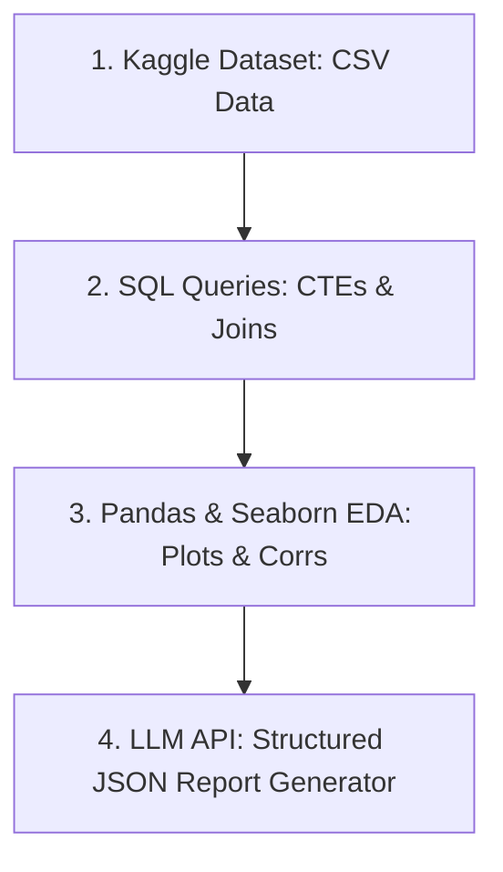

# Student Data Science & AI Portfolio Template

This repository is an **educational portfolio template** designed for students entering the fields of Data Science, Data Analytics, and AI Engineering. 

It demonstrates how to combine **relational database queries (SQL)**, **Exploratory Data Analysis (Python/Pandas/Seaborn)**, and **Generative AI LLM integrations** into a single, unified project that showcase complete technical capability on GitHub.

---

## 📚 Free Course Mapping

This template is structured around skills taught in four popular free educational platforms. You can enroll in the courses using the links below:

1.  **[Kaggle Learn Courses](https://www.kaggle.com/learn)**
    *   *Skills applied*: Tabular data filtering (Pandas), numeric aggregates (NumPy), and correlation heatmaps/scatter plots (Matplotlib & Seaborn).
    *   *Where to look*: [notebooks/eda_visualization.py](notebooks/eda_visualization.py)
2.  **[Google Data Analytics Professional Certificate on Coursera](https://www.coursera.org/professional-certificates/google-data-analytics)** (Audit for free)
    *   *Skills applied*: Data cleaning methodologies, project life-cycle structuring, and SQL queries utilizing CTEs (Common Table Expressions) and window functions.
    *   *Where to look*: [sql_queries/01_schema_setup.sql](sql_queries/01_schema_setup.sql) & [sql_queries/02_exploratory_queries.sql](sql_queries/02_exploratory_queries.sql)
3.  **[Data Analysis with Python Certification on freeCodeCamp](https://www.freecodecamp.org/learn/data-analysis-with-python/)**
    *   *Skills applied*: Cleaning and statistical plotting to compile data science certification portfolios.
    *   *Where to look*: [data/student_performance.csv](data/student_performance.csv) & [notebooks/eda_visualization.py](notebooks/eda_visualization.py)
4.  **[ChatGPT Prompt Engineering for Developers on DeepLearning.AI](https://learn.deeplearning.ai/courses/chatgpt-prompt-engineering-for-developers)**
    *   *Skills applied*: Structuring prompt instructions using XML tags, defining model system roles, and requesting structured outputs (JSON) via API calls.
    *   *Where to look*: [ai_agent/ai_report_generator.py](ai_agent/ai_report_generator.py)

---

## 🔗 How They Connect (The AI & Data Science Workflow)



1.  **Data Sourcing (Kaggle)**: We load a dataset containing student attendance, study hours, and exam scores.
2.  **Structured Database Analytics (SQL/Coursera)**: We write database scripts representing how we would query this table, compute ranks, and extract cohorts.
3.  **Exploratory Data Analysis (Pandas/freeCodeCamp)**: We analyze variables and save scatter plots showing relationships and heatmaps showing correlations.
4.  **AI Integration (DeepLearning.AI)**: We pass the statistical summaries to an LLM (using Hugging Face or Ollama) to automatically generate structured business recommendations in JSON.

---

## 🚀 How Students Can Use This Template

Students can clone this repository to jump-start their own portfolio:

### 1. Setup the Environment
Install Python 3.10+ and run:
```bash
pip install -r requirements.txt
```

### 2. Swap the Dataset
Download any tabular dataset from Kaggle (e.g. Sales, Churn, Weather) and save it in the `data/` folder as a CSV.

### 3. Rewrite SQL Queries
Update the SQL scripts inside `sql_queries/` to match your new dataset's columns and compute cohort pass rates, averages, and ranks.

### 4. Run EDA & Visualizations
Open [notebooks/eda_visualization.py](notebooks/eda_visualization.py) inside your IDE (like VS Code or Jupyter) and change columns to print your new dataset's statistics and save scatter plots.

### 5. Generate AI Reports
Open [ai_agent/ai_report_generator.py](ai_agent/ai_report_generator.py), configure a free API token (e.g. Hugging Face), and run the script to generate an automated recommendation report tailored to your dataset!
```bash
# To run the generator
python ai_agent/ai_report_generator.py
```
