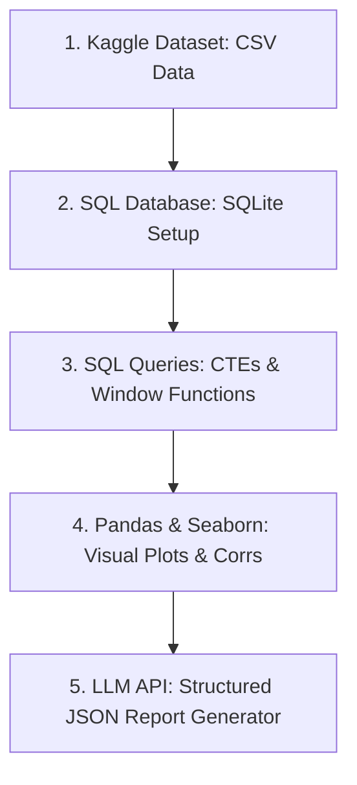

# Student Data Science & AI Portfolio Template

<p align="center">
  
</p>

Welcome to the **Student Data Science & AI Portfolio Template**! This repository is an educational resource designed for students entering the fields of Data Science, Data Analytics, and AI Engineering. 

It demonstrates how to combine **relational database queries (SQL)**, **Exploratory Data Analysis (Python/Pandas/Seaborn)**, and **Generative AI LLM integrations** into a single, unified, automated pipeline on GitHub.

---

## 📚 Free Course Mapping

This template is structured around skills taught in four popular free educational platforms. You can enroll in the courses using the links below:

1.  **[Kaggle Learn Courses](https://www.kaggle.com/learn)**
    *   *Skills applied*: Tabular data filtering (Pandas), numeric aggregates (NumPy), and correlation heatmaps/scatter plots (Matplotlib & Seaborn).
    *   *Where to look*: [notebooks/eda_visualization.py](notebooks/eda_visualization.py)
2.  **[Google Data Analytics Professional Certificate on Coursera](https://www.coursera.org/professional-certificates/google-data-analytics)** (Audit for free)
    *   *Skills applied*: Data cleaning methodologies, project life-cycle structuring, and SQL queries utilizing CTEs (Common Table Expressions) and window functions.
    *   *Where to look*: [sql_queries/01_schema_setup.sql](sql_queries/01_schema_setup.sql) & [sql_queries/02_exploratory_queries.sql](sql_queries/02_exploratory_queries.sql)
3.  **[Data Analysis with Python Certification on freeCodeCamp](https://www.freecodecamp.org/learn/data-analysis-with-python/)**
    *   *Skills applied*: Cleaning and statistical plotting to compile data science certification portfolios.
    *   *Where to look*: [data/student_performance.csv](data/student_performance.csv) & [notebooks/eda_visualization.py](notebooks/eda_visualization.py)
4.  **[ChatGPT Prompt Engineering for Developers on DeepLearning.AI](https://learn.deeplearning.ai/courses/chatgpt-prompt-engineering-for-developers)**
    *   *Skills applied*: Structuring prompt instructions using XML tags, defining model system roles, and requesting structured outputs (JSON) via API calls.
    *   *Where to look*: [ai_agent/ai_report_generator.py](ai_agent/ai_report_generator.py)

---

## 💡 The Modern Data Analyst: Synergy of SQL/Python & AI

Traditional data analysts spend 80% of their time retrieving data (writing SQL) and cleaning/visualizing it (using Python). In the age of AI, the modern data analyst acts as a **system architect** who connects database logic with AI-driven diagnostic insights:

*   **The SQL Layer (SQL + DB)**: Used for exact, deterministic record retrieval. AI is bad at doing heavy calculations or exact sums directly, but SQL databases excel at it.
*   **The Python Layer (Pandas + Seaborn)**: Used to filter data, run statistical tests, and generate visual charts. This provides the mathematical truth of the dataset.
*   **The AI Layer (LLM API + Prompt Engineering)**: Used to interpret the data summaries, find non-obvious recommendations, and structure them as JSON payloads that can be fed into web dashboards, notification systems, or student alert systems.

By marrying these three layers, students demonstrate they can build **automated analytics pipelines** rather than just static reports.

---

## 🔗 How They Connect (The AI & Data Science Workflow)



1.  **Data Sourcing (Kaggle)**: We load a dataset containing student attendance, study hours, and exam scores.
2.  **Local Database (SQLite)**: We initialize a local `students.db` file and import the CSV records automatically.
3.  **Relational Querying (SQL/Coursera)**: We write database scripts using CTEs to group students and dense-rank scores.
4.  **Exploratory Data Analysis (Pandas/freeCodeCamp)**: We analyze variables and save plots showing correlations.
5.  **AI Integration (DeepLearning.AI)**: We pass the statistical summaries to an LLM (using Hugging Face or Ollama) to automatically generate structured business recommendations in JSON.

---

## 🚀 How Students Can Use This Template

Students can clone this repository to jump-start their own portfolio:

### 1. Setup the Environment
Install Python 3.10+ and run:
```bash
pip install -r requirements.txt
```

### 2. Run the End-to-End Pipeline
Execute the main orchestrator script. This will create the database, run SQL queries, generate Seaborn plots, and run the AI generator in one command:
```bash
python main.py
```

### 3. Swap the Dataset
Download any tabular dataset from Kaggle (e.g. Sales, Churn, Weather) and save it in the `data/` folder as a CSV.

### 4. Update the SQL & Python Code
- Update the SQL queries in `sql_queries/` to match your columns.
- Update `notebooks/eda_visualization.py` to plot your new variables.
- Run `python main.py` again to automatically update your database and generate new plots and AI recommendations!

### 5. Check CI/CD Workflows
This repository has a built-in **GitHub Actions CI workflow** (`.github/workflows/verify.yml`). When you push your code, GitHub automatically runs a syntax verification check to prove your code is clean and deployable.
